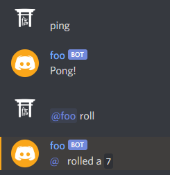

# discord-bot

A [discord.js](https://discord.js.org/#/) wrapper to reduce effort in making Discord bots

Mainly for personal use

# Installation

After installing [Node.js](https://nodejs.org/), run the following command in your package directory:

```
npm install github:ducktrshessami/discord-bot
```

This will probably never be on [npm](https://www.npmjs.com/).

discord.js also lists some [optional dependencies in their documentation](https://discord.js.org/#/docs/main/master/general/welcome) to enable voice support and various optimizations.

# Usage

```js
const DiscordBot = require("discord-bot");
const readline = require("readline");

const ios = new readline.Interface({
    input: process.stdin,
    output: process.stdout
});

let roll = new DiscordBot.Command("roll", rollCommand);
let ping = new DiscordBot.Response("ping", "Pong!");

let client = new DiscordBot(
    {
        token: "BOT_TOKEN",
        admin: [ "USER_ID" ]
    },
    [ roll ],
    [ ping ]
);

ios.on("line", line => {
    if (line.toLowerCase().trim() == "exit") {
        client.destroy();
        ios.close();
    }
})

function rollCommand(message) {
    let num = Math.ceil(Math.random() * 20); // Roll a D20
    message.channel.send(`<@${message.author.id}> rolled a \`${num}\``).catch(console.error);
}
```



# Documentation

In this documentation, the [discord.js](https://discord.js.org/#/) module will simply be referred to as `discord`.

## Table of Contents

1. [Class: DiscordBot](#class-discordbot)
    - [DiscordBot](#discordbotconfig-commands-responses)
    - [DiscordBot.loopPresences](#discordbotlooppresenceslist-minutes-shuffle)
    - [DiscordBot.newPresence](#discordbotnewpresencepresence-time)

2. [Class: DiscordBot.Command](#class-discordbotcommand)
    - [DiscordBot.Command](#discordbotcommandcmd-cb-options)
    - [Command.check](#commandcheckmessage-prefix-admin-execute)
    - [Command.exec](#commandexecmessage-args)
    - [DiscordBot.Command.getArgs](#static-commandgetargsmessage-prefix)

3. [Class: DiscordBot.Response](#class-discordbotresponse)
    - [DiscordBot.Response](#discordbotresponsetrigger-response-checkfunction-responsefunction-options)
    - [Response.check](#responsecheckmessage-execute)
    - [Response.say](#responsesaymessage)

## Class: DiscordBot

DiscordBot extends [discord.Client](https://discord.js.org/#/docs/main/stable/class/Client)

### DiscordBot(config[, commands, responses])

DiscordBot constructor

#### Params:
- `config`: `Object`:
    - `token`: `String` The bot's token obtained from the [Discord Developer Portal](https://discord.com/developers/applications)
    - `admin`: `Array<discord.Snowflake>` [User IDs](https://support.discord.com/hc/en-us/articles/206346498-Where-can-I-find-my-User-Server-Message-ID-) of users designated as botmins
    - `options`: [`discord.ClientOptions`](https://discord.js.org/#/docs/main/stable/typedef/ClientOptions) (Optional)
    - `embedColor`: [`discord.ColorResolvable`](https://discord.js.org/#/docs/main/stable/typedef/ColorResolvable) (Optional) The color for message embeds. Mostly for the pregenerated command list sent by the `help` command
    - `generateCmd`: `Object`: (Optional) Set any of the following to `true` to use the preset command shown
        - `help`: `Boolean` (Optional)

            ```json
            usage: "@bot help [cmd]"
            description: "Displays a command list or describes a specific command"
            subtitle: "<> denotes a required parameter, while [] denotes an optional one"
            ```

        - `prefix`: `Boolean` (Optional)

            ```json
            usage: "@bot prefix [prefix]"
            description: "Set or display the current server's custom command prefix"
            subtitle: "@bot will always work for commands even if a custom prefix is set"
            ```

- `commands`: `Array<DiscordBot.Command>` (Optional) The [Commands](#class-discordbotcommand) for this bot to handle
- `responses`: `Array<DiscordBot.Response>` (Optional) The [Responses](#class-discordbotresponse) for this bot to handle

### DiscordBot.loopPresences(list, minutes[, shuffle])

Set a list of presences to cycle through. The `Timeout` that handles this cycle is stored in `DiscordBot.pTimeout`.

#### Params:
- `list`: `Array<discord.PresenceData>` [Presences](https://discord.js.org/#/docs/main/stable/typedef/PresenceData) to loop
- `minutes`: `Number` The interval to loop presences at (in minutes)
- `shuffle`: `Boolean` (Optional) Set to `true` to randomize the order presences are set. Defaults to `true`

### DiscordBot.newPresence([presence, time])

Sets a new presence for a duration. Called internally by `DiscordBot.loopPresences`.

If no presence or duration is passed, uses a data stored from `DiscordBot.loopPresences`.

#### Params:
- `presence`: [`discord.PresenceData`](https://discord.js.org/#/docs/main/stable/typedef/PresenceData) (Optional)
- `time`: `Number` (Optional) The duration for this presence to be displayed. If [`loopPresences`] has been called, goes back to looping the set presences.

## Class: DiscordBot.Command

Commands passed to a `DiscordBot` instance will automatically be triggered by messages with the `Message.content` in the following format:

```
[prefix]<cmd> [args]
```

The default prefix for a bot is an @ mention. This cannot be disabled.

After being passed to a `DiscordBot` instance the `Command` will be given a `client` property that references the `DiscordBot` instance. This can be used as an alternative to referencing the `Message.client` property within the command callback.

### DiscordBot.Command(cmd, cb[, options])

Command constructor

Params:
- `cmd`: `String` The commmand's name
- `cb`: `function(message, args)` The callback when the command is triggered

    Params:
    - `message`: `discord.Message` The message that triggered the command
    - `args`: `Array<String>` The args parsed from the message (CLI format so args[0] is the cmd)
- `options`: `Object`: (Optional)
    - `usage`: `String` (Optional) For display in the help command
    - `description`: `String` (Optional) For display in the help command
    - `subtitle`: `String` (Optional) For display in the help command
    - `hidden`: `Boolean` (Optional) Set to `true` to be unlisted in the help command
    - `owner`: `Boolean` (Optional) Set to `true` to restrict the command to the server owner
    - `admin`: `Boolean` (Optional) Set to `true` to restrict the command to bot admins
    - `aliases`: `Array<String>` (Optional) Alternate command names that trigger the same callback

### Command.check(message[, prefix, admin, execute])

Checks if a message would trigger the command

Internally called by `DiscordBot` instances when handling commands

Params:
- `message`: `discord.Message` The message to check
- `prefix`: `String` (Optional) The command prefix used in the message
- `admin`: `Boolean` (Optional) Whether the message's author is admin or not. Defaults to `false`
- `execute`: `Boolean` (Optional) Set to `true` to call the callback on passing check. Defaults to `true`

Returns: `Boolean` Whether the message passed the check or not

### Command.exec(message[, args])

Calls the command's callback on a Message

Internally called by `DiscordBot` after calling `Command.check`

Params:
- `message`: `discord.Message` The message that triggered the command
- `args`: `Array<String>` (Optional) The args parsed from the message

### static Command.getArgs(message[, prefix])

## Class: DiscordBot.Response

### DiscordBot.Response(trigger[, response, checkFunction, responseFunction, options])

### Response.check(message[, execute])

### Response.say(message)
